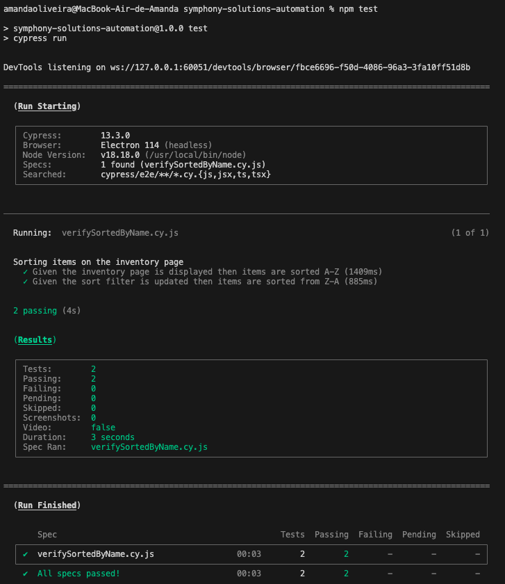
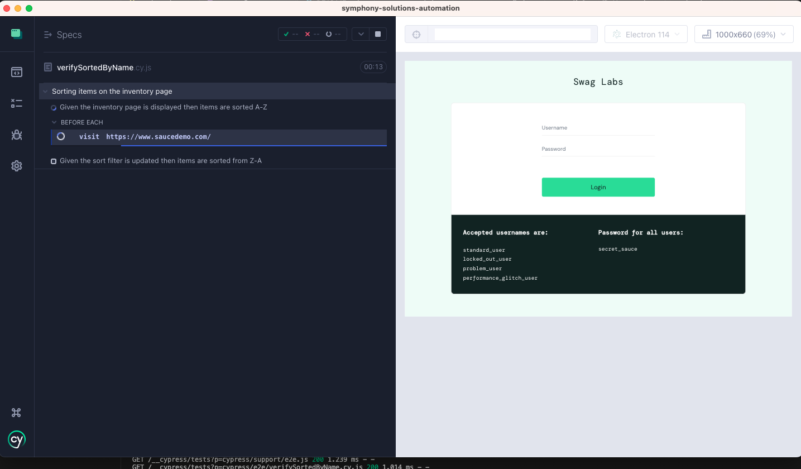

# Symphony Solutions challenge with UI testing

The repository was created to publish the code developed from a challenge proposed in Symphony Solutions' recruitment process. 

## Briefing

Create (design and implement) an automated API test using any JS framework or library (e.g., Request with Cypress; Playwright with request, etc.).

## Development tools 
* Cypress@13.3.0 - https://www.cypress.io/

## How to run tests 

#### 1. Install Node.JS 
https://nodejs.org/en/download

#### 2. Install npm
To do this, you can use Homebrew to install npm package globally - https://brew.sh/
```bash 
brew install -g npm 
```
#### 3. Check the versions to see if the installations were successful 
```bash 
node --version 
npm --version 
```
This project used: 
```bash 
node --version 
v18.18.0
npm --version 
9.8.1
```

#### 4. Clone repository in your local environment using script in your terminal 
```bash
git clone https://github.com/amandacosqa/symphony-solutions-automation.git
```

#### 5. Install the project dependencies 
```bash 
npm install 
```

#### 6. Run tests 
```bash 
npm test 
```
## How tests are reported
* In the terminal console 


* On interface of Cypress
